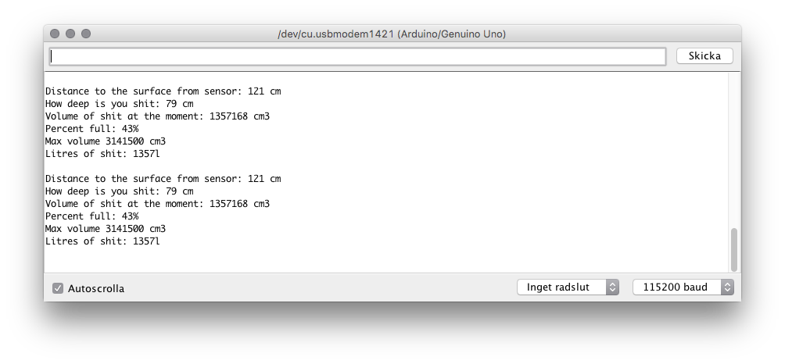

# internet-of-shit
Arduino project to measure, track and calculate poop volume in a tank.

Many houses are connected to sewers and don't have to think about this but if you have a closed system that needs to be emptied once in a while (depending on usage) this might be useful.. It may not be the most important issue to solve but if you forget to empty you tank of poop you might end up in deep shit (literally speaking). With an ultrasonic sensor and an Arduino kit I tried to solve this in techie way. An easy solution would be to lift the lid once in a while but then you can't get the data, statistics, tracking and all other things that comes with an automated solution.

This is the first version but the plan is to connect the project to a Domoticz home automation system and get notifications, graphs and other functionality.

I use the library NewPing for controlling the sensor: https://bitbucket.org/teckel12/arduino-new-ping/wiki/Home 

OUTPUT
------
The level is measured once every second at the moment. Definately overkill for all use cases. The output is sent to the serial monitor at 115200 baud. Will be changed in the future but good for debugging.

THE TANK
--------
We have a cylindrical tank buried in the ground beside the how. The measures in the code are related like this:

THE MATH
--------
The formula for "volume in a horizontal cylinder form" I use is explained here: http://www.mathopenref.com/cylindervolpartial.html. The size of the tank is important to know and the placement of the sensor.

